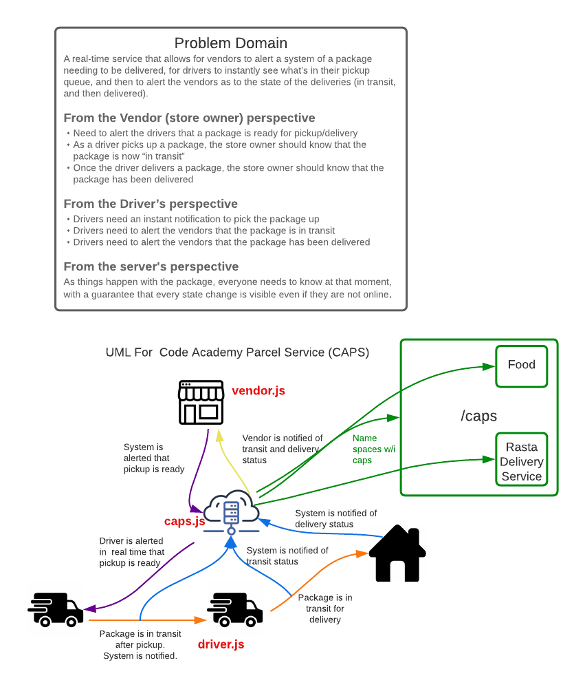

# Code Academy Parcel Service (CAPS)

## Author: Clement Buchanan

- Test Report:
- Front-end Deployment: [Heroku deployment link]()

### Setup

1. Requirements
    - error handlers
    - middleware
    - PORT: 3333

### Technical Requirements

1. Node.js
1. ES6 Classes and best practices
1. ExpressJS Web Server
   - For simulating pickup requests
   - For simulating delivery scans
1. In-Memory messaging queue
1. Test Driven Development, using Jest
1. Tests will use a 3rd party library called supergoose to:
     - “mock” the mongo running database
     - “mock” the running Express server
1. Deployment to Heroku

#### UML

